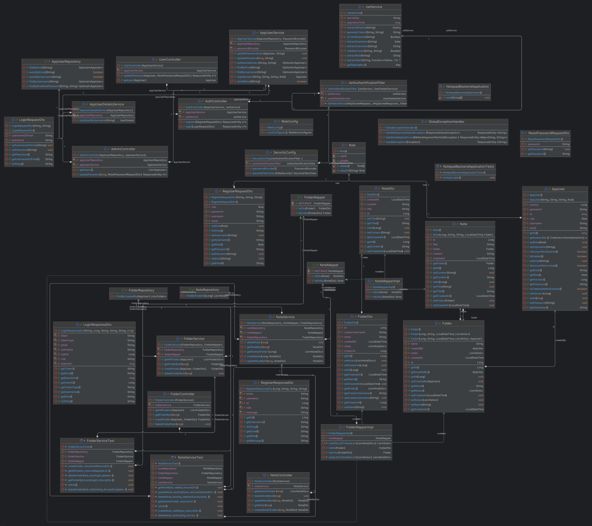
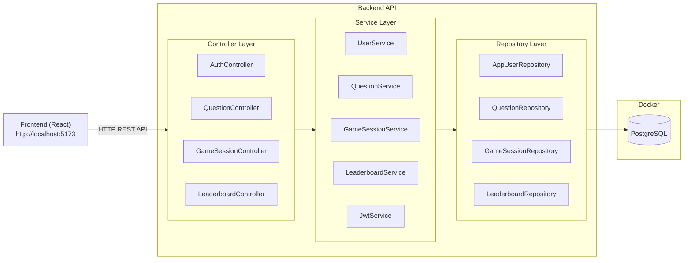
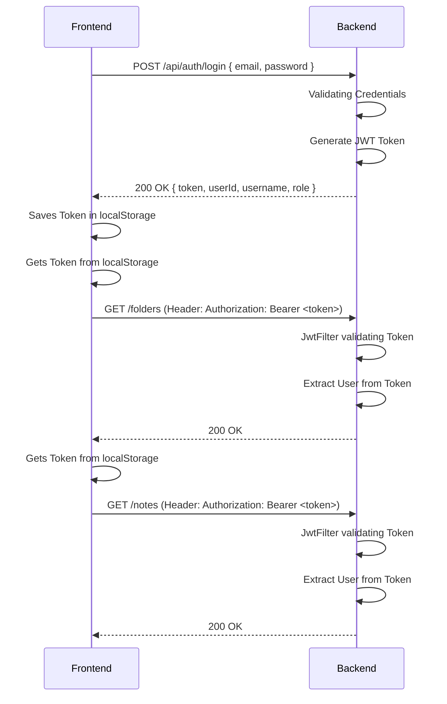

# Project Documentation – Notepad+++

This document contains the full documentation for the Notepad+++ application, created for modules **M294 (Frontend)** and **M295 (Backend)** and implement the newly learnd UserAuth with JWT-Tokens form the module **M223**.

---

## Table of contents
- [Project Documentation – Notepad+++](#project-documentation--notepad)
  - [Table of contents](#table-of-contents)
  - [Project Idea](#project-idea)
    - [Overview](#overview)
    - [Purpose](#purpose)
  - [Requirements](#requirements)
    - [Functional Requirements](#functional-requirements)
    - [UI/UX Functional Flow (Frontend-Specific Behaviour)](#uiux-functional-flow-frontend-specific-behaviour)
      - [Directory Sidebar](#directory-sidebar)
      - [Notes Display \& Interaction](#notes-display--interaction)
      - [Note Management](#note-management)
      - [Admin-User Management](#admin-user-management)
      - [User Page](#user-page)
    - [Non-Functional Requirements](#non-functional-requirements)
  - [Use Cases](#use-cases)
    - [Use Case 1: Create Folder](#use-case-1-create-folder)
    - [Use Case 2: Add Note to Folder](#use-case-2-add-note-to-folder)
    - [Use Case 3: View and Edit Note](#use-case-3-view-and-edit-note)
    - [Use Case 4: Delete Note](#use-case-4-delete-note)
    - [Use Case 5: Delete Folder](#use-case-5-delete-folder)
    - [Use Case 6: User-Login](#use-case-6-user-login)
    - [Use Case 7: Admin-Userpassword set](#use-case-7-admin-userpassword-set)
  - [Class Diagram](#class-diagram)
    - [Diagram](#diagram)
    - [Entities \& Relationships](#entities--relationships)
      - [ERD](#erd)
  - [Architecture](#architecture)
    - [Archithecture Backend](#archithecture-backend)
    - [Archithecture Frontend](#archithecture-frontend)
    - [JWT-Auth Flow Diagramm](#jwt-auth-flow-diagramm)
    - [Tech-Stack](#tech-stack)
      - [Table](#table)
      - [Specification](#specification)
  - [REST API](#rest-api)
    - [Overview](#overview-1)
    - [Endpoints](#endpoints)
      - [Folder Endpoints](#folder-endpoints)
      - [Note Endpoints](#note-endpoints)
    - [Data Models](#data-models)
      - [Folder (Request/Response)](#folder-requestresponse)
      - [Note (Request/Response)](#note-requestresponse)
  - [Test Plan](#test-plan)
    - [Environment](#environment)
    - [Manual API testing (Postman)](#manual-api-testing-postman)
    - [Summary (Manual API Testing)](#summary-manual-api-testing)
    - [Backend Unit Tests (JUnit)](#backend-unit-tests-junit)
      - [Summary](#summary)
    - [Manual Frontend Testing](#manual-frontend-testing)
      - [Summary](#summary-1)
    - [Frontend Unit Tests (Vitest)](#frontend-unit-tests-vitest)
      - [Summary (Frontend Unit)](#summary-frontend-unit)
  - [Installation Instructions](#installation-instructions)
    - [Backend Setup](#backend-setup)
    - [Frontend Setup](#frontend-setup)
  - [Support Log](#support-log)
    - [Online Resources](#online-resources)

---

## Project Idea

### Overview

TWith this app you can create notes and directories for different ideas and project to keep them clean and structured.

Simply create a idea/project directory for example, Holiday trip ideas. Then open that directory and create notes for everything you need to keep track off.

You can add as many notes as you want inside a directory and name them accordingly like Hotels, Restaurants, or Sightseeing Activities.

If you need to change something in a note, just click and edit it. If a note is no longer relevant, delete it. Once a project is finished, you can remove the whole directory.

### Purpose

Have you ever tried to build your own note-taking system? Maybe on paper? Or with something like OneNote?

The problem with paper is it gets messy. Notes get lost, mistakes are hard to fix, and organizing multiple topics is nearly impossible.

And while OneNote seems like a digital solution, it often ends up cluttered. You might have experienced this: you're deep into a project and need to find a note from the beginning but everything is buried. The structure is gone, and you’re back to square one.

Here’s the solution:
A simple, clean, and minimalistic note-taking app that lets you organize your notes by project or idea.
It’s a bit like digital sticky notes — but smarter, more structured, and impossible to lose.

---

## Requirements

### Functional Requirements

- The **USER** can create a note directory and assign it a custom name.
- The **USER** can create notes inside a selected directory and name them individually.
- The **USER** can view the content of each note.
- The **USER** can edit a note and add or change its content.
- The **USER** can delete individual notes.
- The **USER** can delete entire directories when they are no longer needed.
- The **USER** is only able to see his own directories and notes
- The **ADMIN** can set a users password
- The **USER** or **ADMIN** should be stored in local storage for a fast access to the page. **TOKEN**, **USERNAME** and **EMAIL** will be stored.
- On **LOGOUT** the **STORAGE** will be destoreyd.

---

### UI/UX Functional Flow (Frontend-Specific Behaviour)

#### Directory Sidebar

- A sidebar displays all note directories.
- A “Create Directory” button opens a pop-up with a name input field.
- New directories appear in the sidebar, sorted by creation date.
- Each directory has a trash can icon to delete it (with confirmation dialog).
- Clicking a directory shows all its notes in the main section.

#### Notes Display & Interaction

- The main section shows notes belonging to the selected directory.
- A “Create Note” button opens a pop-up with:
  - A title input field
  - A multiline text field
  - A confirm/create button
- Created notes appear as cards (squares) in the main area.

#### Note Management

- Clicking a note opens a pop-up showing the note’s content.
- The pop-up includes:
  - An “Edit Note” button to enable editing
  - A “Delete Note” button (with confirmation dialog)
  - A “Done Editing” button to save changes
  - A “Close (X)” button to close the pop-up
- After deleting a note, it is removed from the UI immediately.
- Deleting a directory also removes all contained notes and resets the main screen.

#### Admin-User Management

- The **ADMIN** has his own space, where he can see all the **USERS** in one list and can set the Passwords if needed

#### User Page

- The **USER** go to his page and can see his stats like username, email.
- The **USER** can reset his password on this page.

---

### Non-Functional Requirements

- The application should load quickly and respond within 1 second to CRUD actions.
- The system must persist all data in a MySQL database (via Docker).
- The backend must validate all inputs and return proper error messages.
- The UI should give user feedback (loading states, error/success toasts).
- The system must include basic unit tests for both frontend and backend logic.
- The application must be installable via a short and clear setup guide.

---

## Use Cases

### Use Case 1: Create Folder

- **Actor**: User
- **Preconditions**: User is on the main view of the application
- **Steps**:
  1. User clicks the "Create Directory" button in the sidebar
  2. A pop-up appears asking for the folder name
  3. User enters a name and confirms
- **Expected Result**:  
  A new directory appears in the sidebar, sorted by creation date

---

### Use Case 2: Add Note to Folder

- **Actor**: User
- **Preconditions**: A folder is selected
- **Steps**:
  1. User clicks the "Create Note" button in the main section
  2. A pop-up appears with a title field and a text field
  3. User enters note content and clicks "Create"
- **Expected Result**:  
  A new note card appears in the main section, linked to the selected folder

---

### Use Case 3: View and Edit Note

- **Actor**: User
- **Preconditions**: At least one note exists in the selected folder
- **Steps**:
  1. User clicks on a note card
  2. A pop-up appears showing the note content
  3. User clicks "Edit Note"
  4. User changes the content and clicks "Done Editing"
- **Expected Result**:  
  The note is updated and saved; the updated content is shown in the note pop-up

---

### Use Case 4: Delete Note

- **Actor**: User
- **Preconditions**: At least one note exists
- **Steps**:
  1. User clicks on a note card
  2. In the pop-up, user clicks the "Delete Note" button
  3. A confirmation dialog appears
  4. User confirms deletion
- **Expected Result**:  
  The note is permanently deleted and removed from the main section

---

### Use Case 5: Delete Folder

- **Actor**: User
- **Preconditions**: At least one folder exists
- **Steps**:
  1. User clicks the trash can icon next to a folder name in the sidebar
  2. A confirmation dialog appears
  3. User confirms deletion
- **Expected Result**:  
  The folder and all contained notes are deleted; the main view resets

---

### Use Case 6: User-Login

- **Actor**: User
- **Preconditions**: Not logged in
- **Steps**:
  1. User enters email/username
  2. User enters password
  3. User clicks login
- **Expected Result**:  
  The user gets redirected and can see his folders and notes.

---

### Use Case 7: Admin-Userpassword set

- **Actor**: Admin
- **Preconditions**: Logged in as Admin
- **Steps**:
  1. Admin clicks on admin button
  2. Admin chooses a user
  3. Admin enters a new password
- **Expected Result**:  
  The Users password should be set to the admin one

---

## Class Diagram

### Diagram



### Entities & Relationships

- **Folder**

  - `id` (Long): Unique identifier
  - `name` (String): Folder title
  - `createdAt` (Timestamp): Date of creation

- **Note**
  - `id` (Long): Unique identifier
  - `title` (String): Note title
  - `content` (Text): The main text of the note
  - `createdAt` (Timestamp): Date of creation
  - `folderId` (Long): Foreign key referencing the owning folder
  - `created_by_user_id` (Long): Foreign key referencing the user

**Relationship:**  
One `Folder` → has many `Note`  
One `Note` → belongs to one `Folder`
One `User` → has many `Folder`  
One `Folder` → belongs to one `User`

#### ERD


---

## Architecture

### Archithecture Backend



### Archithecture Frontend

```
src
│   ├── App.jsx
│   ├── components
│   │   ├── AdminTable.jsx
│   │   ├── button.jsx
│   │   ├── FolderItem.jsx
│   │   ├── layout.jsx
│   │   ├── login-form.jsx
│   │   ├── navigation.jsx
│   │   ├── NoteCard.jsx
│   │   ├── PopupFolder.jsx
│   │   ├── PopupNote.jsx
│   │   ├── PopupReadNote.jsx
│   │   ├── protected-route.jsx
│   │   ├── register-form.jsx
│   │   ├── Sidebar.jsx
│   │   └── __tests__
│   │       ├── FolderItem.test.jsx
│   │       ├── NoteCard.test.jsx
│   │       └── PopupNote.test.jsx
│   ├── contexts
│   │   └── AuthContext.jsx
│   ├── index.css
│   ├── main.jsx
│   ├── pages
│   │   ├── Admin.jsx
│   │   ├── Forbidden.jsx
│   │   ├── Login.jsx
│   │   ├── MainPage.jsx
│   │   ├── PageNotFound.jsx
│   │   ├── Register.jsx
│   │   └── UserProfile.jsx
│   └── services
│       ├── api.js
│       └── auth-service.js
```

### JWT-Auth Flow Diagramm




---

### Tech-Stack
#### Table

| Tech              | Version           | Usage           |
| ---               | ---               | ---             |
| Java              |                   |                 |     
| Spring Boot       |                   |                 |
| Spring Security   |                   |                 |
| JWT               |                   |                 |
| JPA/Hibernate     |                   |                 |
| MySQL             |                   |                 |
| BCrypt            |                   |                 |
| Maven             |                   |                 |
| Docker            |                   |                 |
| Vite
| React
| Axios


#### Specification

The choice for the Backend was **JAVA** with **Spring Boot** as the Frame Work. 

For Scurity we can use **Spring Security** wich is provided from Spring. A User Logs into the Application and the Backend in the **JWT-Service** a **TOKEN** will be generated and sent to the Frontend. In the Frontend this token will be stored in **LOCAL-Storage**. For every request from the Frontend we send now the token in the **HEADER** for Authentication. In the Backend the **JWT-Filter** validates that token and extract the **USER** from it. 

For the communitcation backend to database we use **JPA-Repositories**. This repository generates **QUERRIES** based on the Function name.
For the Database itself we choose a **MySQL** inside a **Docker** containers for easy setup.
**BCrypt** is used to **HASH** passwords so even when a hacker gets access to the database he will not have the plain passwords.

For the Frontend we use **React**. It is more like a library than a full Framework. It is easy to use and allows to get many predefined components from the web.

For the Communication between frontend and backend we use **Axios**. It simplifies API calls, handles responses and errors. It supports headers and tokens. We implemented **interceptors** to handle headers and the token in the header.

**Vite** provides fast dev server and shows the changes almost imideatily in the browser. It also optimizes builds.


---

## REST API

### Overview

The REST API exposes endpoints for managing **folders** and their associated **notes**.  
Each folder acts as a container for multiple notes, and all CRUD operations are supported.

### Endpoints  

#### Folder Endpoints

| Method | Endpoint        | Description               | Request Body | Response        |
| ------ | --------------- | ------------------------- | ------------ | --------------- |
|     | `/folders`      | List all folders          | –            | List of folders |
|     | `/folders/{id}` | Get a single folder       | –            | Folder + notes  |
|    | `/folders`      | Create new folder         | Folder JSON  | Created folder  |
|  | `/folders/{id}` | Delete folder & its notes | –            | 204 No Content  |

#### Note Endpoints

| Method | Endpoint              | Description           | Request Body | Response       |
| ------ | --------------------- | --------------------- | ------------ | -------------- |
|     | `/folders/{id}/notes` | Get notes in a folder | –            | List of notes  |
|    | `/folders/{id}/notes` | Add note to folder    | Note JSON    | Created note   |
|     | `/notes/{noteId}`     | Get single note       | –            | Note JSON      |
|     | `/notes/{noteId}`     | Update existing note  | Note JSON    | Updated note   |
|  | `/notes/{noteId}`     | Delete note           | –            | 204 No Content |

### Data Models

#### Folder (Request/Response)

```json
{
  "id": 1,
  "name": "Holiday Ideas",
  "createdAt": "2025-06-28T10:00:00Z"
}
```

#### Note (Request/Response)

```json
{
  "id": 12,
  "title": "Hotel research",
  "content": "Check out Booking.com and compare prices.",
  "createdAt": "2025-06-28T10:15:00Z",
  "folderId": 1
}
```

---

## Test Plan

### Environment

- Node.js / React
- Spring Boot
- MySQL (Docker)
- Browser: Chrome
- Tools: Postman, JUnit, Jest

---

### Manual API testing (Postman)

| Test ID | Endpoint                 | Description                   | Expected Status | Status |
| ------- | ------------------------ | ----------------------------- | --------------- | ------ |
| TC01    | POST /folders            | Create folder                 | 200 OK          | ✓      |
| TC02    | GET /folders             | Get all folders               | 200 OK          | ✓      |
| TC03    | GET /folders/{id}        | Get folder by ID              | 200 OK          | ✓      |
| TC04    | POST /folders/{id}/notes | Add note to folder            | 200 OK          | ✓      |
| TC05    | GET /folders/{id}/notes  | Get notes in folder           | 200 OK          | ✓      |
| TC06    | GET /notes/{id}          | Get single note by ID         | 200 OK          | ✓      |
| TC07    | PUT /notes/{id}          | Update existing note          | 200 OK          | ✓      |
| TC08    | GET /folders/{id}        | Verify note appears in folder | 200 OK          | ✓      |
| TC09    | DELETE /notes/{id}       | Delete note                   | 204 No Content  | ✓      |
| TC10    | DELETE /folders/{id}     | Delete folder and its notes   | 204 No Content  | ✓      |

---

### Summary (Manual API Testing)

- Total Tests: 10
- Passed: 10
- Failed: 0
- Blocked: 0

---

### Backend Unit Tests (JUnit)

| Test ID | Class / Method                 | Description                                 | Expected Result                    | Status |
| ------- | ------------------------------ | ------------------------------------------- | ---------------------------------- | ------ |
| TC11    | FolderService.getAllFolders    | Returns a list of mapped FolderDto objects  | List size matches mock repository  | ✓      |
| TC12    | FolderService.getFolderById    | Returns single FolderDto                    | DTO with matching ID is returned   | ✓      |
| TC13    | FolderService.createFolder     | Maps DTO to entity, saves, and returns DTO  | Created folder DTO returned        | ✓      |
| TC14    | FolderService.deleteFolderById | Deletes folder if it exists                 | Repository delete method is called | ✓      |
| TC15    | NoteService.getNotesInFolder   | Returns list of notes for a given folder ID | List of NoteDto returned           | ✓      |
| TC16    | NoteService.getNoteById        | Retrieves single note by ID                 | Matching NoteDto returned          | ✓      |
| TC17    | NoteService.createNote         | Creates a new Note under an existing folder | Saved NoteDto is returned          | ✓      |
| TC18    | NoteService.updateNoteById     | Updates existing note content/title         | Changes saved and returned         | ✓      |
| TC19    | NoteService.deleteNote         | Deletes note if it exists                   | Repository delete called           | ✓      |
| TC20    | NoteService.deleteNote (fail)  | Throws if note does not exist               | Exception is thrown                | ✓      |

#### Summary

- Total Tests: 10
- Passed: 10
- Failed: 0
- Blocked: 0

---

### Manual Frontend Testing

| Test ID | Feature       | Description                                                            | Expected Result                                                  | Status |
| ------- | ------------- | ---------------------------------------------------------------------- | ---------------------------------------------------------------- | ------ |
| TC21    | Create Folder | Clicking "New Folder" opens a form; after confirming, folder appears   | New folder is shown in the sidebar                               | ✓      |
| TC22    | Select Folder | Clicking on a folder in the sidebar                                    | Notes in that folder are shown; "New Note" button visible        | ✓      |
| TC23    | Create Note   | Clicking "New Note" opens a form; after confirming, note is created    | New note appears in the main area                                | ✓      |
| TC24    | Read Note     | Clicking on a note                                                     | Note content is displayed                                        | ✓      |
| TC25    | Update Note   | Clicking "Edit Note" allows editing; after confirming, note is updated | Updated content is saved and displayed                           | ✓      |
| TC26    | Delete Note   | Clicking on a note → "Delete" → confirm                                | Note is deleted and removed from the main screen                 | ✓      |
| TC27    | Delete Folder | Clicking the X button next to a folder and confirming deletion         | Folder is removed from sidebar and all related notes are deleted | ✓      |

#### Summary

- Total Tests: 7
- Passed: 7
- Failed: 0
- Blocked: 0

### Frontend Unit Tests (Vitest)

| Test ID | Component / Feature | Description                             | Expected Result                       | Status |
| ------- | ------------------- | --------------------------------------- | ------------------------------------- | ------ |
| TC28    | NoteCard            | Renders title and triggers onClick      | Note title appears, click is handled  | ✓      |
| TC29    | FolderItem          | Renders folder and handles delete/click | Name shown, delete and click work     | ✓      |
| TC30    | PopupNote           | Handles form input and triggers create  | Note is submitted, onCreate is called | ✓      |

#### Summary (Frontend Unit)

- Total Tests: 3
- Passed: 3
- Failed: 0
- Blocked: 0

---

## Installation Instructions

### Backend Setup

**Requirements:**

- Java 17+
- Maven
- Docker & Docker Compose

**Steps:**

1. Clone the repo:

```bash
git clone https://github.com/dein-benutzername/notepad---.git
cd notepad+++
```

2. Run MySQL container:

```bash
cd db
docker compose up -d
```

3. Run the Spring Boot application:

```bash
cd backend
./mvnw spring-boot:run
```

### Frontend Setup

**Requirements:**

- Node.js
- npm

**Steps:**

1. Change to frontend directory:

```bash
cd frontend/
```

2. Install packages:

```bash
 npm install
```

3. Run the frontend:

```bash
npm run dev
```

---

## Support Log

### Online Resources

- [Spring Boot CRUD + MySQL Guide](https://www.baeldung.com/spring-boot-crud-thymeleaf)
- [React + Axios API Setup](https://axios-http.com/docs/intro)
- [Vitest Dokumentation](https://vitest.dev/guide/)
- [Testing Library Examples](https://testing-library.com/docs/react-testing-library/example-intro)
- Chat Gpt "For Formating help in the documentation and as last resort for coding help"

---
